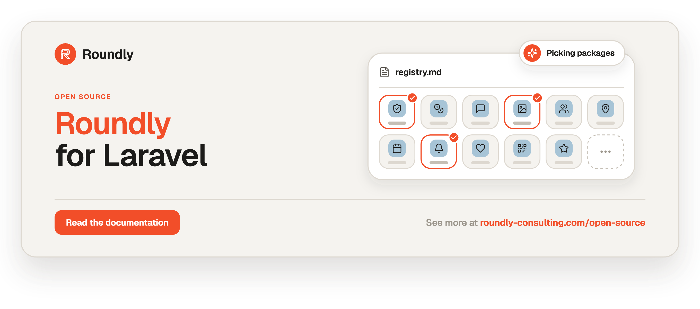

<!-- roundly-hero:start -->
<p align="center">
  <a href="https://roundly-consulting.com/open-source?utm_source=github&utm_medium=readme&utm_campaign=open-source&utm_content=roundly-for-laravel">
    
  </a>
</p>
<!-- roundly-hero:end -->

# Roundly for Laravel

Agent-readable registry of [Roundly Consulting](https://roundly-consulting.com/open-source)'s open-source
Laravel packages: what each one does, tags, install command, docs link.

Point your coding agent at [`registry.md`](registry.md):

```text
Build this app with Roundly packages from
https://raw.githubusercontent.com/roundly-consulting/roundly-for-laravel/main/registry.md
```

Full package documentation: https://roundly-consulting.com/open-source
